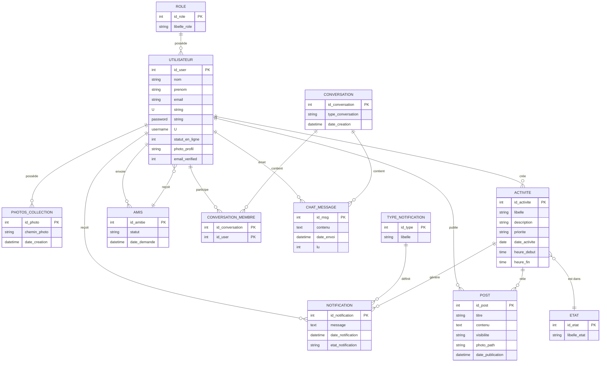

# Modélisation Merise de la base de données WorkFlow

## 1. Contexte

Cette base de données supporte l’application WorkFlow, une plateforme web collaborative de gestion d’activités, de réseau social, de messagerie, de publications et de notifications.

## 2. MCD (Modèle Conceptuel de Données)

### 2.1 Entités principales

- `UTILISATEUR`
  - Attributs : `id_user`, `nom`, `prenom`, `email`, `password`, `username`, `statut_en_ligne`, `photo_profil`, `email_verified`, `otp_code`, `otp_expires_at`, `recovery_token`, `recovery_token_expires_at`, `created_at`

- `ROLE`
  - Attributs : `id_role`, `libelle_role`

- `ACTIVITE`
  - Attributs : `id_activite`, `libelle`, `description`, `priorite`, `date_activite`, `heure_debut`, `heure_fin`

- `ETAT`
  - Attributs : `id_etat`, `libelle_etat`

- `AMIS`
  - Attributs : `id_amitie`, `statut`, `date_demande`

- `CONVERSATION`
  - Attributs : `id_conversation`, `type_conversation`, `date_creation`

- `CHAT_MESSAGE`
  - Attributs : `id_msg`, `contenu`, `date_envoi`, `lu`

- `POST`
  - Attributs : `id_post`, `titre`, `contenu`, `visibilite`, `photo_path`, `date_publication`

- `TYPE_NOTIFICATION`
  - Attributs : `id_type`, `libelle`

- `NOTIFICATION`
  - Attributs : `id_notification`, `message`, `date_notification`, `etat_notification`

- `PHOTOS_COLLECTION`
  - Attributs : `id_photo`, `chemin_photo`, `date_creation`

### 2.2 Associations et cardinalités

- `UTILISATEUR` - `ROLE`
  - 1 rôle est attribué à N utilisateurs.
  - Cardinalités : `ROLE (1,1) <==> UTILISATEUR (0,N)`

- `UTILISATEUR` - `ACTIVITE`
  - 1 utilisateur crée N activités.
  - Cardinalités : `UTILISATEUR (1,1) <==> ACTIVITE (0,N)`

- `ACTIVITE` - `ETAT`
  - 1 état est appliqué à N activités.
  - Cardinalités : `ETAT (1,1) <==> ACTIVITE (0,N)`

- `UTILISATEUR` - `AMIS` (relation d’amitié)
  - Un utilisateur peut envoyer et recevoir des demandes d’amitié.
  - `AMIS` est une relation binaire auto-associative sur `UTILISATEUR`.
  - Cardinalités : `UTILISATEUR (1,1) <==> AMIS (0,N)` pour chaque rôle (demandeur et receveur).

- `UTILISATEUR` - `CONVERSATION`
  - 1 conversation regroupe plusieurs participants.
  - Interaction gérée par l’entité associative `CONVERSATION_MEMBRE`.
  - Cardinalités : `UTILISATEUR (1,1) <==> CONVERSATION_MEMBRE (0,N)` et `CONVERSATION (1,1) <==> CONVERSATION_MEMBRE (0,N)`.

- `CONVERSATION` - `CHAT_MESSAGE`
  - 1 conversation contient N messages.
  - Cardinalités : `CONVERSATION (1,1) <==> CHAT_MESSAGE (0,N)`.

- `UTILISATEUR` - `CHAT_MESSAGE`
  - 1 utilisateur envoie N messages.
  - Cardinalités : `UTILISATEUR (1,1) <==> CHAT_MESSAGE (0,N)`.

- `UTILISATEUR` - `POST`
  - 1 utilisateur publie N posts.
  - Cardinalités : `UTILISATEUR (1,1) <==> POST (0,N)`.

- `ACTIVITE` - `POST`
  - 1 activité peut être associée à 0 ou N posts.
  - Cardinalités : `ACTIVITE (0,1) <==> POST (0,N)`.

- `UTILISATEUR` - `NOTIFICATION`
  - 1 utilisateur reçoit N notifications.
  - Cardinalités : `UTILISATEUR (1,1) <==> NOTIFICATION (0,N)`.

- `TYPE_NOTIFICATION` - `NOTIFICATION`
  - 1 type de notification peut être utilisé pour N notifications.
  - Cardinalités : `TYPE_NOTIFICATION (1,1) <==> NOTIFICATION (0,N)`.

- `ACTIVITE` - `NOTIFICATION`
  - 1 activité peut générer 0 ou N notifications.
  - Cardinalités : `ACTIVITE (0,1) <==> NOTIFICATION (0,N)`.

- `UTILISATEUR` - `PHOTOS_COLLECTION`
  - 1 utilisateur peut avoir N photos en collection.
  - Cardinalités : `UTILISATEUR (1,1) <==> PHOTOS_COLLECTION (0,N)`.

## 3. MLD (Modèle Logique de Données)

### 3.1 Relations et contraintes

#### `ROLE`
- `id_role` : clé primaire
- `libelle_role`

#### `UTILISATEUR`
- `id_user` : clé primaire
- `nom`, `prenom`, `email` (unique), `password`, `username` (unique)
- `id_role` : clé étrangère vers `ROLE(id_role)`
- `statut_en_ligne`, `photo_profil`, `email_verified`
- `otp_code`, `otp_expires_at`, `recovery_token`, `recovery_token_expires_at`, `created_at`

#### `ETAT`
- `id_etat` : clé primaire
- `libelle_etat`

#### `ACTIVITE`
- `id_activite` : clé primaire
- `libelle`, `description`, `priorite`, `date_activite`, `heure_debut`, `heure_fin`
- `id_etat` : clé étrangère vers `ETAT(id_etat)`
- `id_user` : clé étrangère vers `UTILISATEUR(id_user)`

#### `AMIS`
- `id_amitie` : clé primaire
- `id_demandeur` : clé étrangère vers `UTILISATEUR(id_user)`
- `id_receveur` : clé étrangère vers `UTILISATEUR(id_user)`
- `statut` : `pending`, `accepted`, `declined`
- `date_demande`
- Contrainte d’unicité : (`id_demandeur`, `id_receveur`)

#### `CONVERSATION`
- `id_conversation` : clé primaire
- `type_conversation`, `date_creation`

#### `CONVERSATION_MEMBRE`
- `id_conversation`, `id_user` : clé primaire composée
- `id_conversation` : clé étrangère vers `CONVERSATION(id_conversation)`
- `id_user` : clé étrangère vers `UTILISATEUR(id_user)`

#### `CHAT_MESSAGE`
- `id_msg` : clé primaire
- `id_conversation` : clé étrangère vers `CONVERSATION(id_conversation)`
- `id_user` : clé étrangère vers `UTILISATEUR(id_user)`
- `contenu`, `date_envoi`, `lu`

#### `POST`
- `id_post` : clé primaire
- `id_user` : clé étrangère vers `UTILISATEUR(id_user)`
- `titre`, `contenu`, `visibilite`, `photo_path`, `date_publication`
- `id_activite` : clé étrangère optionnelle vers `ACTIVITE(id_activite)`

#### `TYPE_NOTIFICATION`
- `id_type` : clé primaire
- `libelle`

#### `NOTIFICATION`
- `id_notification` : clé primaire
- `id_user` : clé étrangère vers `UTILISATEUR(id_user)`
- `id_type` : clé étrangère vers `TYPE_NOTIFICATION(id_type)`
- `id_activite` : clé étrangère optionnelle vers `ACTIVITE(id_activite)`
- `message`, `date_notification`, `etat_notification`

#### `PHOTOS_COLLECTION`
- `id_photo` : clé primaire
- `id_user` : clé étrangère vers `UTILISATEUR(id_user)`
- `chemin_photo`, `date_creation`

## 4. Schéma relationnel physique

Voici le modèle physique tel qu’implémenté dans le fichier `public_html/database/workflow.sql` :

- `role(id_role PK, libelle_role)`
- `utilisateur(id_user PK, nom, prenom, email UNIQUE, password, username UNIQUE, id_role FK->role.id_role, statut_en_ligne, photo_profil, email_verified, otp_code, otp_expires_at, recovery_token, recovery_token_expires_at, created_at)`
- `photos_collection(id_photo PK, id_user FK->utilisateur.id_user, chemin_photo, date_creation)`
- `etat(id_etat PK, libelle_etat)`
- `activite(id_activite PK, libelle, description, priorite, date_activite, heure_debut, heure_fin, id_etat FK->etat.id_etat, id_user FK->utilisateur.id_user)`
- `amis(id_amitie PK, id_demandeur FK->utilisateur.id_user, id_receveur FK->utilisateur.id_user, statut, date_demande, UNIQUE(id_demandeur,id_receveur))`
- `conversation(id_conversation PK, type_conversation, date_creation)`
- `conversation_membre(id_conversation FK->conversation.id_conversation, id_user FK->utilisateur.id_user, PK(id_conversation,id_user))`
- `chat_message(id_msg PK, id_conversation FK->conversation.id_conversation, id_user FK->utilisateur.id_user, contenu, date_envoi, lu)`
- `post(id_post PK, id_user FK->utilisateur.id_user, titre, contenu, visibilite, id_activite FK->activite.id_activite, photo_path, date_publication)`
- `type_notification(id_type PK, libelle)`
- `notification(id_notification PK, id_user FK->utilisateur.id_user, id_type FK->type_notification.id_type, id_activite FK->activite.id_activite, message, date_notification, etat_notification)`

## 5. Diagramme Merise (textuel)

### 5.1 Entité / Association

- UTILISATEUR (1,N) --- Posséder --- (1,1) ROLE
- UTILISATEUR (1,N) --- Créer --- (0,N) ACTIVITE
- ACTIVITE (0,N) --- A pour état --- (1,1) ETAT
- UTILISATEUR (1,N) --- A pour demandes --- (0,N) AMIS --- (1,N) UTILISATEUR
- UTILISATEUR (1,N) --- Participe à --- (0,N) CONVERSATION_MEMBRE --- (1,N) CONVERSATION
- CONVERSATION (1,N) --- Contient --- (0,N) CHAT_MESSAGE
- UTILISATEUR (1,N) --- Émet --- (0,N) CHAT_MESSAGE
- UTILISATEUR (1,N) --- Rédige --- (0,N) POST
- ACTIVITE (0,1) --- Est lié à --- (0,N) POST
- UTILISATEUR (1,N) --- Reçoit --- (0,N) NOTIFICATION
- TYPE_NOTIFICATION (1,N) --- Définit --- (0,N) NOTIFICATION
- ACTIVITE (0,1) --- Génère --- (0,N) NOTIFICATION
- UTILISATEUR (1,N) --- Possède --- (0,N) PHOTOS_COLLECTION

## 6. Remarques Merise

- `AMIS` est une association réflexive entre deux utilisateurs : elle représente une relation binaire avec statut.
- `CONVERSATION_MEMBRE` est une entité associative qui transforme la relation N-N entre `UTILISATEUR` et `CONVERSATION` en deux relations 1-N.
- Les tables `ETAT`, `ROLE` et `TYPE_NOTIFICATION` sont des tables de type « dictionnaire » ou « domaine ».
- La cardinalité minimale de `POST` vers `ACTIVITE` est 0 car une publication n’est pas nécessairement liée à une activité.
- `NOTIFICATION` peut être liée à une activité ou être indépendante, ce qui rend `id_activite` optionnelle.

## 7. Utilisation du modèle

Ce modèle Merise permet de comprendre la structure de la base de données et de l’utiliser comme référence pour :

- la maintenance de la base de données,
- l’ajout de nouvelles fonctionnalités,
- la création de rapports et exportations,
- le passage à une conception plus complète si nécessaire.

## 8. Version graphique textuelle du MCD

### 8.1 Diagramme ASCII simplifié

```
ROLE 1---N UTILISATEUR
         |
         | 1---N PHOTOS_COLLECTION
         |
         | 1---N ACTIVITE --- 1---N POST
         |                  \
         |                   \-- 0,1
         |                      ACTIVITE
         |
         | 1---N NOTIFICATION --- N---1 TYPE_NOTIFICATION
         |
         | 1---N CHAT_MESSAGE --- N---1 CONVERSATION
         |                     \
         |                      \-- N---1 CONVERSATION_MEMBRE --- N---1 CONVERSATION
         |
         \-- N---1 AMIS --- N---> UTILISATEUR
```

### 8.2 Diagramme Mermaid pour visualisation



